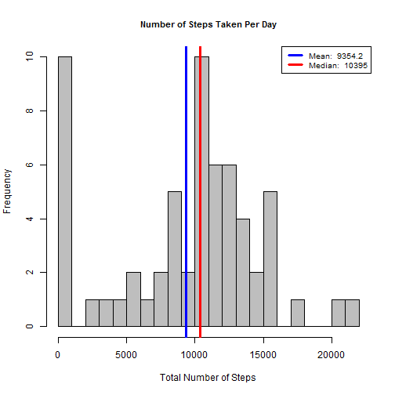
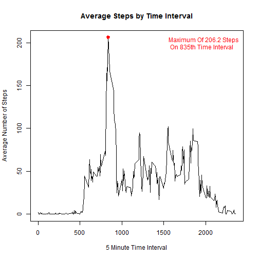
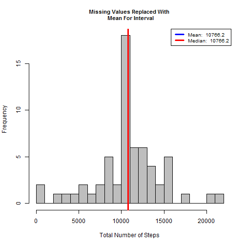

### This is the assignment work for Coursera-Reproducible Research Peer Assessment 1

## Loading and preprocessing the data

First download the data from the instructions site https://d396qusza40orc.cloudfront.net/repdata%2Fdata%2Factivity.zip into R working directory

This assignment makes use of data from a personal activity monitoring device. This device collects data at 5 minute intervals through out the day. The data consists of two months of data from an anonymous individual collected during the months of October and November, 2012 and include the number of steps taken in 5 minute intervals each day
The variables included in this dataset are:
 
1. steps: Number of steps taking in a 5-minute interval (missing values are coded as NA) 

2. date: The date on which the measurement was taken in YYYY-MM-DD format

3. interval: Identifier for the 5-minute interval in which measurement was taken

Then read the data into data frame actdata

```r
actdata = read.csv('activity.csv', header = T)
names(actdata)
```

```
## [1] "steps"    "date"     "interval"
```

```r
str(actdata)
```

```
## 'data.frame':	17568 obs. of  3 variables:
##  $ steps   : int  NA NA NA NA NA NA NA NA NA NA ...
##  $ date    : Factor w/ 61 levels "2012-10-01","2012-10-02",..: 1 1 1 1 1 1 1 1 1 1 ...
##  $ interval: int  0 5 10 15 20 25 30 35 40 45 ...
```

```r
head(actdata)
```

```
##   steps       date interval
## 1    NA 2012-10-01        0
## 2    NA 2012-10-01        5
## 3    NA 2012-10-01       10
## 4    NA 2012-10-01       15
## 5    NA 2012-10-01       20
## 6    NA 2012-10-01       25
```

## What is mean total number of steps taken per day?

1. Make a histogram of the total number of steps taken each day
2. Calculate and report the mean and median total number of steps taken
per day

Summarize the data by day:

```r
library(data.table)
dat_tbl = data.table(actdata)
dat_tbl_by_day = dat_tbl[, list(total_steps = sum(steps, na.rm = T)),by = date]
```

Write and Call make histogram function

```r
#Writing this as a function for re-use later
make_hist = function(x, title){
	hist(x, breaks = 20, main = title, xlab = 'Total Number of Steps', col = 'grey', cex.main = .9)
	
	#caluclate mean and median
	mean_value = round(mean(x), 1)
	median_value = round(median(x), 1)
	
	#draw lines for mean and median on histogram
	abline(v=mean_value, lwd = 3, col = 'blue')
	abline(v=median_value, lwd = 3, col = 'red')
	
	#create legend
	legend('topright', lty = 1, lwd = 3, col = c("blue", "red"), cex = .8, legend = c(paste('Mean: ', mean_value), paste('Median: ', median_value)))
}

#Call the function
make_hist(dat_tbl_by_day$total_steps, 'Number of Steps Taken Per Day')
```

 


## What is the average daily activity pattern?
1. Make a time series plot (i.e. type = "l") of the 5-minute interval (x-axis)
and the average number of steps taken, averaged across all days (y-axis)
2. Which 5-minute interval, on average across all the days in the dataset,
contains the maximum number of steps?


```r
#summarize dataset by interval
dat_tbl_by_interval = dat_tbl[, list(avg_steps = mean(steps, na.rm = T)), by = interval]

#plot the time series
with(dat_tbl_by_interval, {
        plot(interval, avg_steps, type = 'l', main = 'Average Steps by Time Interval', xlab = '5 Minute Time Interval', ylab = 'Average Number of Steps')
        })
		
#Find interval that has the Maximum average Steps
max_steps = dat_tbl_by_interval[which.max(avg_steps), ]

#Generate label 
max_lab = paste('Maximum Of ', round(max_steps$avg_steps, 1), ' Steps \n On ', max_steps$interval, 'th Time Interval', sep = '')

#Collect co-ordinates of the Max Interval
points(max_steps$interval,  max_steps$avg_steps, col = 'red', lwd = 3, pch = 19)

#Add label to annotate Maximum # Steps And Interval
legend("topright", legend = max_lab, text.col = 'red', bty = 'n' )
```

 

## Imputing missing values

1.Calculate and report the total number of missing values in the dataset (i.e. the total number of rows with NAs)


```r
sum(is.na(actdata$steps))
```

```
## [1] 2304
```

2. Devise a strategy for filling in all of the missing values in the dataset. The
strategy does not need to be sophisticated. For example, you could use
the mean/median for that day, or the mean for that 5-minute interval, etc.
3. Create a new dataset that is equal to the original dataset but with the
missing data filled in.


```r
#Join the average number of steps per interval data frame to the original dataset
setkey(dat_tbl, interval)
setkey(dat_tbl_by_interval, interval)


#Create function to replace if value is NA
NA_replace = function(x,y){
	if(is.na(x)){                
		return(y)
	}
	return(x)
}

#Call the function and replace NA values
dat_tbl_miss = dat_tbl[dat_tbl_by_interval]
dat_tbl_miss$new_steps = mapply(NA_replace,dat_tbl_miss$steps, dat_tbl_miss$avg_steps)

#Summarize new dataset by day
dat_tbl_summary_miss = dat_tbl_miss[, list(new_steps = sum(new_steps, na.rm = T)), by = date]

#Preview new dataset
head(dat_tbl_summary_miss)
```

```
##          date new_steps
## 1: 2012-10-01  10766.19
## 2: 2012-10-02    126.00
## 3: 2012-10-03  11352.00
## 4: 2012-10-04  12116.00
## 5: 2012-10-05  13294.00
## 6: 2012-10-06  15420.00
```
4. Make a histogram of the total number of steps taken each day and Calculate
and report the mean and median total number of steps taken per day.


```r
make_hist(dat_tbl_by_day$total_steps, 'Missing Values Removed')
```

 

```r
make_hist(dat_tbl_summary_miss$new_steps, 'Missing Values Replaced With \n Mean For Interval')
```

 

**Answer To Question:**
 Do these values differ from the estimates from the first part of the assignment?
 What is the impact of imputing missing data on the estimates of the total daily number of steps?

 The Mean and Median values differ from the values from first part of assignment before replacing the missing values.
 The Mean and Median values are almost the same after replacing missing values.


## Are there differences in activity patterns between weekdays and weekends?

Create a new variable in the dataset with two values: weekday or weekend

```r
getweekday = function(x){
	if(x %in% c('Saturday', 'Sunday')){return('Weekend')}        
	return('Weekday')
}

#Add dayname
dat_tbl_miss$dayname = weekdays(as.Date(dat_tbl_miss$date))

#Add daytype 
dat_tbl_miss$daytype = as.factor(apply(as.matrix(dat_tbl_miss$dayname), 1, getweekday))

#Summarize Dataset: Mean grouped by interval and daytype
dat_tbl_summary_miss = dat_tbl_miss[, list(avg_steps = mean(new_steps, na.rm = T)), 
                          by = list(interval, daytype)]

#Inspect dataset
str(dat_tbl_summary_miss)
```

```
## Classes 'data.table' and 'data.frame':	576 obs. of  3 variables:
##  $ interval : int  0 0 5 5 10 10 15 15 20 20 ...
##  $ daytype  : Factor w/ 2 levels "Weekday","Weekend": 1 2 1 2 1 2 1 2 1 2 ...
##  $ avg_steps: num  2.2512 0.2146 0.4453 0.0425 0.1732 ...
##  - attr(*, ".internal.selfref")=<externalptr>
```

Draw Panel plot:

```r
library(lattice)
xyplot(avg_steps~interval | daytype, data = dat_tbl_summary_miss,
      type = 'l',
      xlab = 'Interval',
      ylab = 'Number of Steps',
      layout = c(1,2))
```

 
